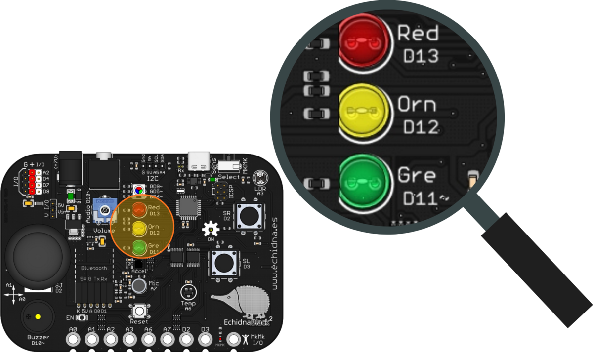
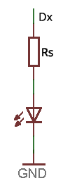
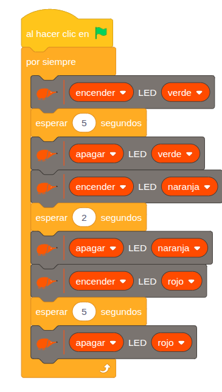
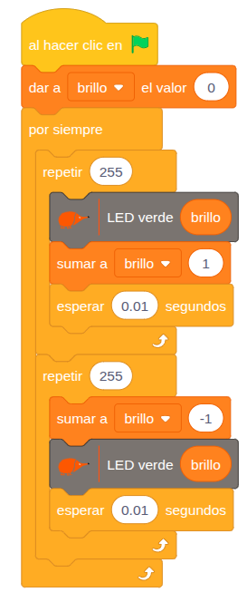

La EchidnaBlack2 tiene tres LED, verde, naranja y rojo, como los de un semáforo (de ahí ROG, por sus nombres en inglés: *red*, *orange* y *green*). Sirven para indicar estados del programa o para hacer las primeras prácticas.

## Descripción

LED son las siglas de *Light Emitting Diode*, diodo emisor de luz. Funcionan gracias a la **electroluminiscencia**: cuando circula corriente por ellos, emiten luz. Se usan como testigos o indicadores y, cada vez más, para iluminar.

En la placa están en columna junto al rótulo de cada uno: **Red** (rojo, D13), **Orn** (naranja, D12) y **Gre** (verde, D11~).

## Funcionamiento

Al aplicarle tensión, el LED se enciende. Desde el programa lo podemos controlar de dos formas:

- **Digital**: un `1` lo enciende y un `0` lo apaga. Funciona con los tres LED.
- **PWM**: un valor entre `0` y `255` regula el brillo. Solo en el LED verde, que está en el pin D11~ (el símbolo `~` indica que el pin admite PWM).

Todos los LED se conectan con una resistencia en serie (Rs) que limita la corriente que los atraviesa. En la EchidnaBlack2 ya está incluida, así que no hay que añadir nada.

## Cómo se programa

En **EchidnaML** hay un bloque para encender o apagar cada LED: se elige la acción y el color.

Para el LED verde hay otro bloque que ajusta su brillo entre 0 (apagado) y 255 (máximo brillo).

## Ejemplos

### Semáforo

El programa enciende los LED uno detrás de otro, como un semáforo, y repite el ciclo sin parar:

1. El LED verde se enciende durante 5 segundos y se apaga.
2. El LED naranja se enciende durante 2 segundos y se apaga.
3. El LED rojo se enciende durante 5 segundos y se apaga.

### Fundido del LED verde

El LED verde se enciende y se apaga poco a poco, con un efecto de fundido (*fade*). El programa usa una variable, `brillo`, y dos bucles seguidos que se repiten sin parar:

- **Encendido progresivo**: el brillo sube de 0 a 255, de uno en uno.
- **Apagado progresivo**: el brillo baja de 255 a 0.

Cada paso espera 0,01 segundos, así que el cambio se ve suave.

