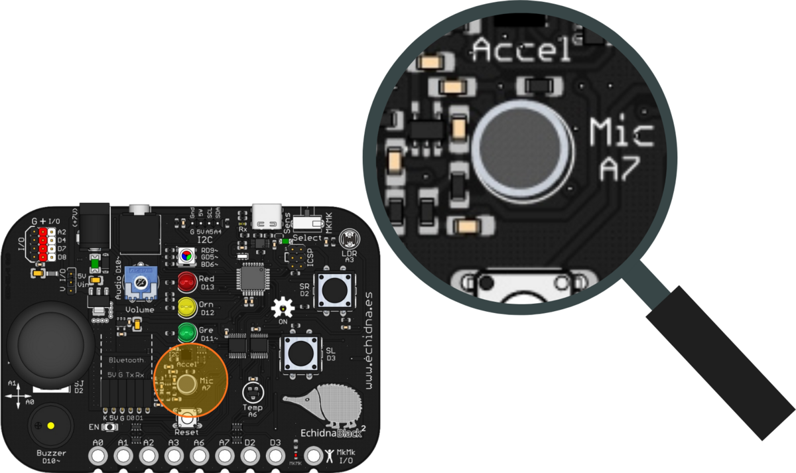
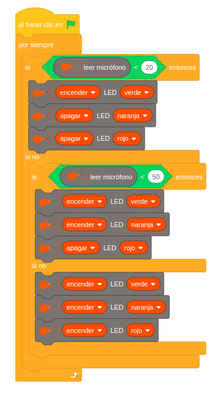
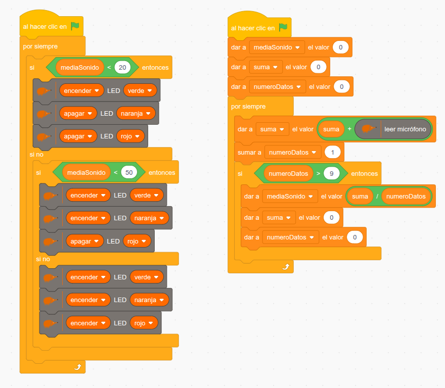

La EchidnaBlack2 tiene un micrófono que capta el sonido del ambiente. Con él se pueden hacer, por ejemplo, medidores de ruido para el aula.

## Descripción

El micrófono es un transductor acústico-eléctrico: convierte las vibraciones del sonido en una señal eléctrica gracias al **efecto piezoeléctrico**. Al recibir una onda sonora, su material piezoeléctrico genera una señal eléctrica con las mismas características (frecuencia y amplitud) que el sonido captado.

En la placa está rotulado Mic A7, junto al acelerómetro.

## Funcionamiento

La señal del micrófono reproduce directamente el sonido recibido, así que cambia constantemente: es una señal analógica compleja y muy variable. Para trabajar con ella hay dos opciones:

- **procesarla**, por ejemplo calculando la media de varias lecturas;
- o usarla solo para detectar la **intensidad** del sonido.

## Cómo se programa

En **EchidnaML**, el micrófono se lee con este bloque. Si marcas su casilla, verás el valor en pantalla:

Devuelve valores **bajos con silencio o poco sonido** y **altos con sonidos intensos**, entre 0 (sin sonido) y 1023 (sonido muy intenso).

## Ejemplos

### Vúmetro

La placa funciona como un semáforo de ruido, que muestra con los LED la intensidad del sonido del ambiente:

- **nivel bajo**: si el micrófono da menos de 20 (silencio), se enciende solo el LED verde;
- **nivel medio**: entre 20 y 50, se encienden el verde y el naranja;
- **nivel alto**: por encima de 50, se encienden los tres.

Al probarlo, seguramente verás que los LED parpadean sin parar: es por la variabilidad de la señal del micrófono. El siguiente ejemplo lo soluciona.

### Vúmetro con media

Para que la señal sea más estable, conviene **filtrarla**. Una técnica sencilla es la **media**: tomar varias lecturas seguidas y calcular su promedio.

Para calcularla, el programa usa tres variables:

- `suma`, que va acumulando las lecturas;
- `numeroDatos`, que cuenta cuántas lecturas lleva;
- `mediaSonido`, que guarda la media.

Cada diez lecturas, divide la suma entre el número de lecturas para obtener la media y vuelve a poner a 0 la suma y el contador. El vúmetro usa `mediaSonido` en lugar de la lectura directa, así que los LED cambian de forma más estable.

