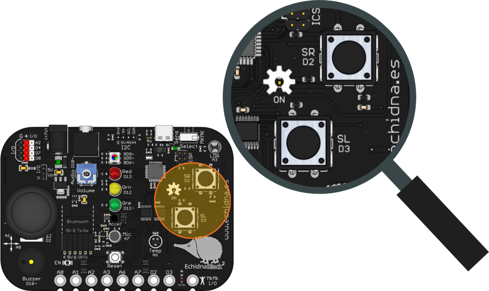
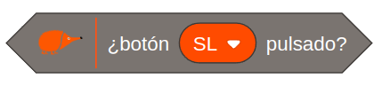
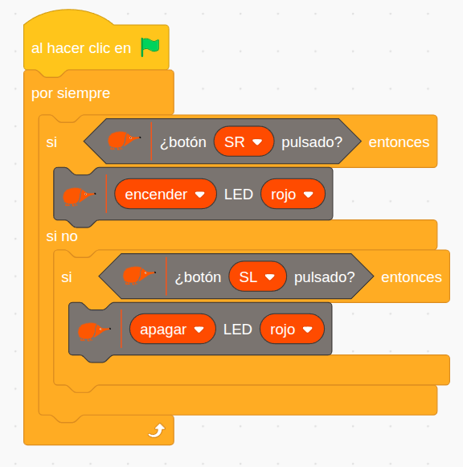

La EchidnaBlack2 tiene dos pulsadores, **SR** y **SL**, que sirven para dar órdenes al programa: encender algo, cambiar de modo, contar pulsaciones…

## Descripción

El pulsador es un componente electromecánico que abre o cierra un circuito y que solo tiene un **estado estable**, el de reposo. En estos pulsadores el estado estable es **abierto** (normalmente abierto): el circuito está interrumpido y solo se cierra mientras se mantiene pulsado. Al soltarlo, vuelve enseguida a estar abierto.

En la placa están en la parte derecha: **SR** (*switch right*, pulsador derecho) en el pin D2 y **SL** (*switch left*, pulsador izquierdo) en el pin D3.

## Funcionamiento

Cada pulsador está conectado con una resistencia a tierra, formando un circuito llamado ***pull-down***: sin pulsar, el pin recibe un `0` (0 V), y al pulsar, un `1` (5 V).

## Cómo se programa

En **EchidnaML**, para leer un pulsador se usa este bloque, que permite elegir el pulsador, SR o SL:

Devuelve **verdadero** (1) si el pulsador está pulsado y **falso** (0) si no lo está.

## Ejemplos

### Encender y apagar el LED con dos pulsadores

El pulsador derecho (SR) enciende el LED rojo y el izquierdo (SL) lo apaga. El programa comprueba sin parar:

- si SR está pulsado, enciende el LED rojo;
- si no, comprueba si SL está pulsado y, en ese caso, apaga el LED rojo.

### Pulsador con memoria

Aquí un solo pulsador funciona como un interruptor: la primera pulsación enciende el LED y la siguiente lo apaga. Para que el programa «recuerde» si el LED está encendido o apagado, usa una variable, `estadoLED`.

Cada vez que se pulsa el botón, el programa consulta `estadoLED`:

- si vale 0 (apagado), enciende el LED y pone `estadoLED` a 1;
- si vale 1 (encendido), apaga el LED y pone `estadoLED` a 0.

Para que el cambio ocurra una sola vez por pulsación, aunque se mantenga el botón pulsado, el programa espera a que se suelte con el bloque **esperar hasta que** no esté pulsado. Así se evitan los rebotes y la variable cambia una sola vez cada vez que se pulsa.

