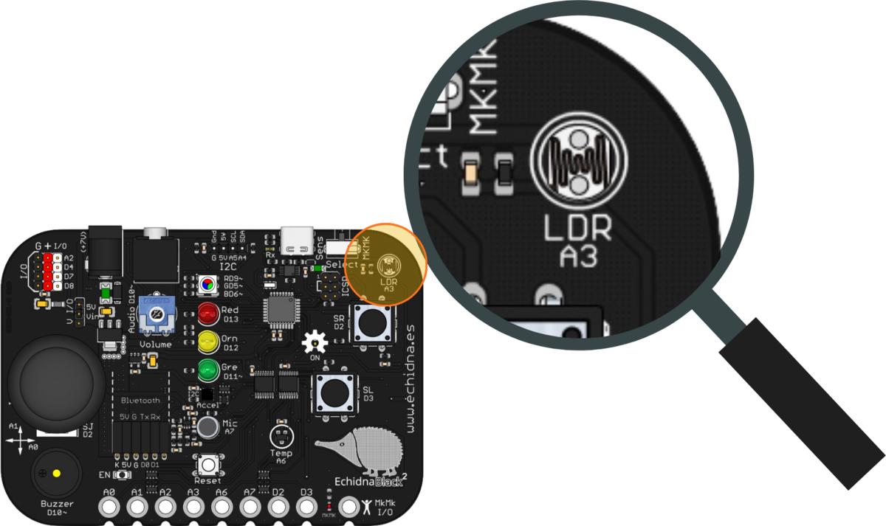
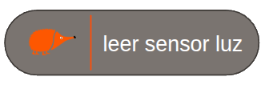
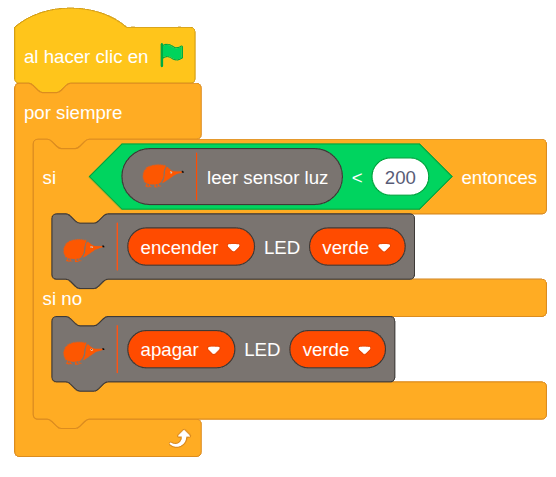

La EchidnaBlack2 tiene un sensor que mide cuánta luz hay a su alrededor. Sirve, por ejemplo, para encender una luz cuando oscurece.

## Descripción

LDR es el acrónimo de *Light Dependent Resistor*, resistencia dependiente de la luz: una resistencia cuyo valor depende de la cantidad de luz que le llega. Suele fabricarse con sulfuro de cadmio.

En la placa está en la esquina superior derecha, rotulada LDR A3.

## Funcionamiento

La LDR tiene una resistencia alta (del orden del megaohmio) con poca luz y baja con mucha luz. En la placa está conectada con una resistencia en serie, formando un **divisor de tensión** que invierte esa lógica: con mucha luz da una tensión alta y con poca luz, una tensión baja.

## Cómo se programa

En **EchidnaML**, el valor del sensor se lee con este bloque. Si marcas su casilla, verás el valor en pantalla:

Devuelve un valor **bajo con poca luz** y **alto con mucha luz**, entre 0 (sin luz) y 1023 (mucha luz). Por las tolerancias de los componentes, los valores pueden variar un poco de una placa a otra.

## Ejemplos

### Interruptor crepuscular

El LED verde se enciende solo cuando hay poca luz, como las farolas al anochecer. El programa comprueba sin parar:

- si el sensor de luz da un valor menor que 200, enciende el LED verde;
- si no, lo apaga.

El valor 200 es el **umbral** que decide cuándo se enciende o se apaga la luz; puedes cambiarlo según la luz de tu aula.

