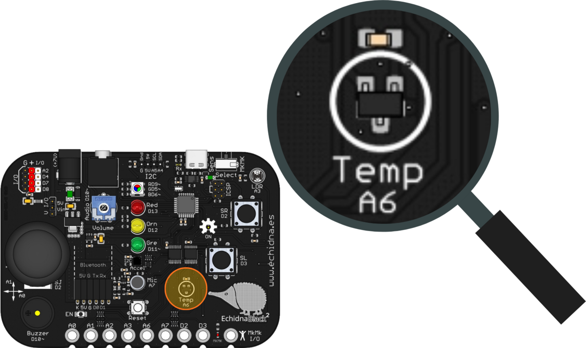
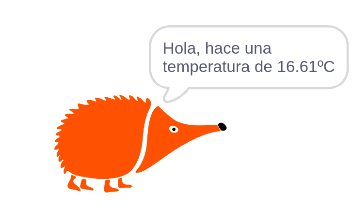
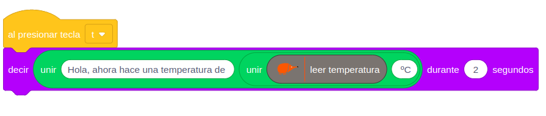

La EchidnaBlack2 tiene un sensor que mide la temperatura del ambiente, para hacer termómetros, alarmas de calor o registrar la temperatura del aula.

## Descripción

El MCP9700T es un sensor que da una tensión analógica proporcional a la temperatura en grados Celsius:

- **Sensibilidad**: cada 10 mV equivalen a 1 °C.
- **Desplazamiento** (*offset*): a 0 °C da 500 mV (0,5 V).
- **Rango**: funciona de −40 °C a +125 °C.

En la placa está en la parte inferior, rotulado Temp A6.

## Funcionamiento

La placa lee la tensión del sensor por el pin A6 y la convierte en grados con esta fórmula, donde V es la tensión en voltios:

T (°C) = (V − 0,5) × 100

Por ejemplo, una lectura de 0,75 V corresponde a (0,75 − 0,5) × 100 = 25 °C.

## Cómo se programa

En **EchidnaML**, la temperatura se lee con este bloque, que ya aplica la fórmula y la da directamente en grados Celsius. Si marcas su casilla, verás el valor en pantalla:

## Ejemplos

### El echidna dice la temperatura

Al pulsar la tecla «t» del teclado, el echidna dice qué temperatura hace:

El programa une el texto «Hola, ahora hace una temperatura de», el valor del sensor y «°C», y el personaje lo dice durante 2 segundos:

