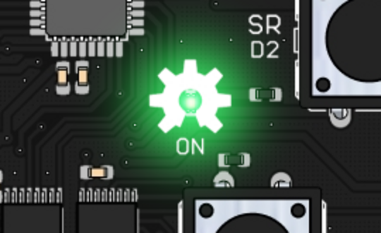

Si la placa no responde, sigue estos pasos en orden, empezando por lo más sencillo. Casi siempre la causa es el cable, el controlador del ordenador o el programa que lleva la placa, no una avería.

## Comprobaciones rápidas

- **El cable**: algunos cables USB-C solo sirven para cargar y no transmiten datos. Prueba con otro cable y con otro puerto USB del ordenador.
- **El LED de encendido**: al conectar la placa se enciende en verde el LED rotulado **ON**, en el centro, dentro del engranaje del logo de hardware libre. Si no se enciende, la placa no recibe corriente: revisa el cable y el puerto.



- **El modo**: si el conmutador está en **modo MkMk**, el joystick, el sensor de luz, el de temperatura, el micrófono y los pulsadores no funcionan. Se explica en [Modo sensores / Modo MkMk](/ecosistema/echidnablack2/modo-sensores-mkmk/).

## EchidnaML no detecta la placa

### 1. ¿El ordenador ve la placa?

Con la placa conectada, mira si el sistema la reconoce como un puerto serie:

- **Windows**: en el *Administrador de dispositivos*, apartado **Puertos (COM y LPT)**, debe aparecer un dispositivo **USB-SERIAL CH340**.
- **GNU/Linux**: en una terminal, `ls /dev/ttyUSB*` debe mostrar un puerto, normalmente `/dev/ttyUSB0`.
- **macOS**: en una terminal, `ls /dev/cu.*` debe mostrar un puerto con `usbserial` o `wchusbserial` en el nombre.

Si no aparece:

- **Falta el controlador**: la placa usa el chip CH340, cuyo controlador se llama **CH341**. Instálalo como se explica en [Descarga › Controlador de la placa](/ecosistema/echidnaml/descarga/#controlador-de-la-placa). En GNU/Linux no suele hacer falta.
- **Si sigue sin aparecer**, vuelve a las [comprobaciones rápidas](#comprobaciones-rápidas): otro cable y otro puerto.

### 2. ¿Tienes permiso para usar el puerto?

En **GNU/Linux**, tu usuario necesita permiso para usar el puerto serie. Si el puerto aparece pero EchidnaML no conecta, ejecuta en una terminal:

```
sudo usermod -a -G dialout tu_usuario
```

Después cierra la sesión y vuelve a entrar. En Windows y macOS el permiso ya está dado.

### 3. ¿Otro programa está usando la placa?

Solo un programa a la vez puede comunicarse con la placa. Cierra el **Arduino IDE**, otras ventanas de EchidnaML y la pestaña del [test en el navegador](#herramientas-de-comprobación) si la tienes abierta.

### 4. ¿Conectaste la placa con EchidnaML ya abierto?

Lo mejor es conectar la placa **antes** de abrir EchidnaML. Si ya estaba abierto, guarda tu proyecto y vuelve a detectar la placa como se explica en [Reconectar la placa](/ecosistema/echidnaml/conectar-placa/#reconectar-la-placa): la detección reinicia el entorno y se pierde lo que no esté guardado.

### 5. ¿La placa tiene StandardFirmata?

EchidnaML se comunica con la placa gracias al programa **StandardFirmata**, que viene cargado de fábrica. Si alguien ha cargado otro programa con el Arduino IDE, EchidnaML ya no la reconoce.

Para comprobarlo, abre el [test en el navegador](https://echidnaeducacion.github.io/echidna-firmata-test/) y pulsa **Conectar**: si la placa responde, tiene StandardFirmata. Si no responde, [instala StandardFirmata](/ecosistema/echidnaml/instalar-standardfirmata/) de nuevo.

## Un componente no responde

Si EchidnaML conecta con la placa pero un sensor o un actuador no funciona:

1. **Comprueba el modo**: en modo MkMk varios sensores dejan de funcionar (ver las [comprobaciones rápidas](#comprobaciones-rápidas)).
2. **Pruébalo aislado** con el [test en el navegador](https://echidnaeducacion.github.io/echidna-firmata-test/): así sabrás si falla el componente o el programa.
3. **Casos conocidos**:
   - **El joystick no llega a los valores extremos**: a veces el capuchón está demasiado hundido y choca con la base. Sácalo un poco hacia arriba.
   - **Un componente externo no funciona o la placa se reinicia**: revisa el selector de [alimentación](/ecosistema/echidnablack2/alimentacion/) de las entradas y salidas y el consumo de lo que hayas conectado.

## Resumen

| Síntoma | Causa probable | Solución |
|---|---|---|
| El LED ON no se enciende | El cable o el puerto | Otro cable de datos y otro puerto |
| El ordenador no ve la placa | Falta el controlador CH341 | [Instalar el controlador](/ecosistema/echidnaml/descarga/#controlador-de-la-placa) |
| La ve, pero EchidnaML no conecta (GNU/Linux) | Sin permiso para el puerto | `sudo usermod -a -G dialout tu_usuario` |
| EchidnaML no conecta | Otro programa usa la placa | Cerrar el Arduino IDE y otras ventanas |
| EchidnaML no conecta | La placa no tiene StandardFirmata | [Instalar StandardFirmata](/ecosistema/echidnaml/instalar-standardfirmata/) |
| Varios sensores no responden | La placa está en modo MkMk | Poner el conmutador en modo sensores |
| El joystick no llega a los extremos | El capuchón está muy hundido | Sacarlo un poco hacia arriba |

## Si nada funciona

[Escríbenos](/contacta/) contando qué has probado, o abre una *issue* en GitHub como se explica en [Cómo colaborar](/docentes/colabora/).

## Herramientas de comprobación

Tres herramientas para probar la placa, de la más sencilla a la más técnica. Las dos que se usan con el Arduino IDE sustituyen a StandardFirmata: al terminar, [vuelve a instalarlo](/ecosistema/echidnaml/instalar-standardfirmata/) para usar la placa con EchidnaML.
