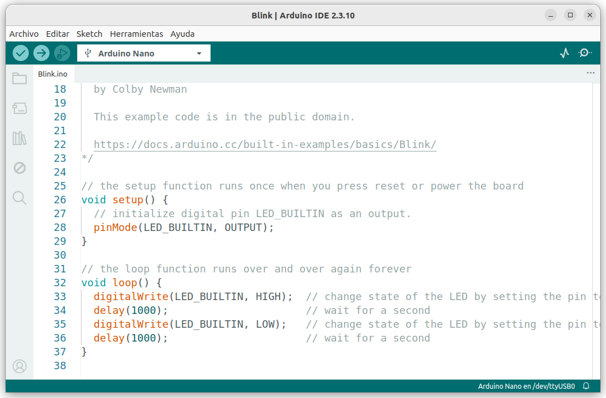
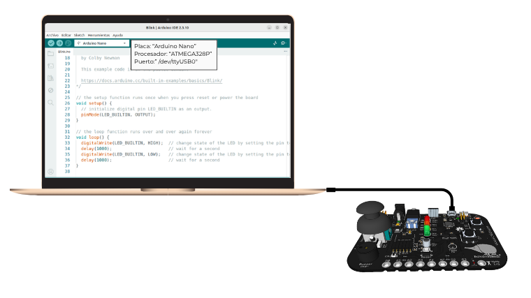
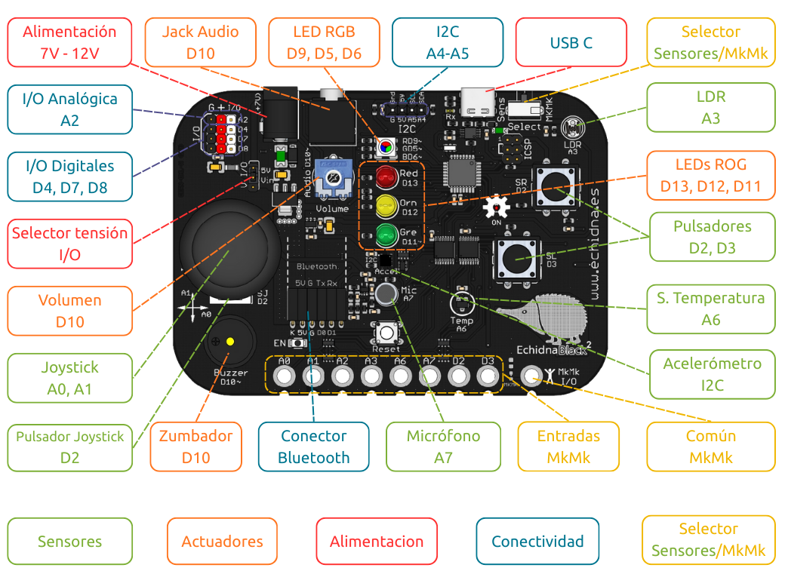

**Arduino IDE** es el entorno oficial de programación para placas Arduino y compatibles. Se basa en **programación textual** (C/C++) y permite un control completo y detallado del hardware. El microcontrolador de la EchidnaBlack2 es un **ATmega328P**, el mismo que el de Arduino Nano, así que se puede programar con Arduino IDE.

Arduino IDE con Echidna es la opción ideal para quienes quieren dar el salto de la programación por bloques a la **programación textual**, trabajando directamente con el código. Es perfecta para estudiantes de los últimos cursos de Secundaria, Bachillerato y Formación Profesional que buscan sacar el máximo rendimiento a la placa en sus proyectos.

## Características

- **Programación textual avanzada**: control total sobre pines, temporización, interrupciones, comunicación y memoria, programando en C/C++.
- **Programación directa del microcontrolador**: el código se carga y se ejecuta directamente en la placa, sin un programa intermedio que haga de puente con el ordenador.
- **Control directo del hardware**: permite trabajar con sensores y actuadores, integrados o externos, con un control preciso y sin capas intermedias.
- **Funcionamiento autónomo**: los proyectos funcionan por sí solos, sin necesidad de tener la placa conectada a un ordenador.

## Instalar Arduino IDE

Arduino IDE es el programa en el que se escribe el código y desde el que se carga en la placa. Es gratuito y funciona en GNU/Linux, Windows y macOS.

1. Descarga la última versión de Arduino IDE 2 desde la [página oficial](https://www.arduino.cc/en/software/), eligiendo tu sistema operativo.
2. Instálalo como cualquier otro programa. Si necesitas ayuda, consulta la [guía de instalación de Arduino](https://docs.arduino.cc/software/ide-v2/tutorials/getting-started-ide-v2/).
3. Abre Arduino IDE. La primera vez puede tardar un poco, porque descarga algunos componentes.



La placa se comunica con el ordenador mediante el chip **CH340**. En GNU/Linux no hace falta instalar nada; en Windows y macOS hay que instalar su controlador, el [driver CH341](/ecosistema/echidnaml/descarga/#controlador-de-la-placa).

En GNU/Linux, si Arduino IDE no puede acceder al puerto de la placa, da permiso a tu usuario desde una terminal con `sudo usermod -a -G dialout $USER` y vuelve a iniciar la sesión.

## Conectar la placa

Conecta la EchidnaBlack2 al ordenador con el cable USB-C y abre Arduino IDE. Antes de cargar un programa hay que indicar qué placa se va a programar y a qué puerto está conectada. En el menú **Herramientas**, elige:

- **Placa**: Arduino AVR Boards › **Arduino Nano**.
- **Procesador**: **ATmega328P**.
- **Puerto**: el puerto USB al que está conectada la placa. Su nombre depende del sistema operativo y el número puede cambiar según los dispositivos conectados: `/dev/ttyUSB0` en GNU/Linux, `COM3` en Windows o `/dev/cu.usbserial-1410` en macOS.



## Estructura de un programa

Un programa de Arduino se llama ***sketch*** y siempre tiene, como mínimo, dos funciones: `setup()` y `loop()`. Es lo que aparece al crear un programa nuevo en Arduino IDE:

```cpp
// aquí van las constantes y las variables

void setup() {
  // se ejecuta una sola vez, al encender la placa
}

void loop() {
  // se repite una y otra vez, para siempre
}
```

- **Antes de `setup()`**: se declaran las constantes (como los pines de los componentes) y las variables que usará el programa.
- **`setup()`**: se ejecuta **una sola vez**, al encender la placa o al cargar el programa. Sirve para prepararla, por ejemplo, para indicar qué pines son entradas y cuáles salidas.
- **`loop()`**: se ejecuta **una y otra vez**, mientras la placa tenga alimentación. Aquí va lo que la placa tiene que hacer continuamente: leer sensores, encender LED, hacer sonar el zumbador…

Al escribir código, ten en cuenta estas reglas:

- Cada instrucción termina con **punto y coma** (`;`).
- Las **llaves** (`{` y `}`) marcan dónde empieza y dónde termina cada bloque de instrucciones, como el contenido de `setup()` o de `loop()`.
- Arduino distingue entre **mayúsculas y minúsculas**: `digitalWrite` funciona, pero `digitalwrite` da error.
- Lo que va detrás de `//` es un **comentario**: explica el programa a quien lo lee y la placa no lo ejecuta.

## Cargar un programa en la placa

Con la placa conectada y elegidos la placa, el procesador y el puerto:

1. Escribe el código en el editor de Arduino IDE.
2. Guárdalo con **Archivo › Guardar**. Arduino IDE guarda cada programa en una carpeta con su mismo nombre.
3. Pulsa **Verificar** (el botón de la marca de verificación, arriba a la izquierda). El IDE comprueba que el código está bien escrito y lo **compila**, es decir, lo traduce a instrucciones que entiende el microcontrolador. Si hay algún error, aparece en la parte inferior de la ventana, con la línea en la que está.
4. Pulsa **Subir** (el botón de la flecha, junto al anterior). El IDE vuelve a compilar el programa y lo carga en la placa. Al terminar, la parte inferior de la ventana indica que la carga se ha completado.

En cuanto termina la carga, la placa empieza a ejecutar el programa. El programa queda guardado en la placa: aunque la desconectes, al volver a alimentarla seguirá funcionando hasta que cargues otro.

Si la carga falla, revisa que:

- la placa está conectada y has elegido el puerto correcto;
- has elegido la placa Arduino Nano con el procesador ATmega328P;
- no hay otro programa usando el puerto, como EchidnaML.

**Atención**: al cargar un programa desde Arduino IDE se borra **StandardFirmata**, el programa que necesita EchidnaML para comunicarse con la placa. Para volver a usarla con EchidnaML, [instala StandardFirmata](/ecosistema/echidnaml/instalar-standardfirmata/) de nuevo.

## Pines de la EchidnaBlack2

Cada componente de la placa está conectado a un pin del microcontrolador, y en los programas se usa ese número para indicar con qué componente se trabaja. No hace falta memorizarlos: en la placa, cada componente lleva serigrafiado su pin al lado (por ejemplo, *Red D13* junto al LED rojo o *Temp A6* junto al sensor de temperatura). Los pines marcados con **~** admiten PWM.



| Componente | Pin | Tipo |
|---|---|---|
| [LED rojo, naranja y verde](/ecosistema/echidnablack2/leds/) | D13, D12 y D11~ | Digital (el verde, también PWM) |
| [LED RGB: rojo, verde y azul](/ecosistema/echidnablack2/led-rgb/) | D9~, D5~ y D6~ | Digital y PWM |
| [Zumbador](/ecosistema/echidnablack2/audio/) | D10~ | Digital y PWM |
| [Pulsadores SR (derecho) y SL (izquierdo)](/ecosistema/echidnablack2/pulsadores/) | D2 y D3 | Digital |
| [Joystick: eje X y eje Y](/ecosistema/echidnablack2/joystick/) | A0 y A1 | Analógico |
| [Sensor de luz (LDR)](/ecosistema/echidnablack2/sensor-luz-ldr/) | A3 | Analógico |
| [Sensor de temperatura](/ecosistema/echidnablack2/sensor-temperatura/) | A6 | Analógico |
| [Micrófono](/ecosistema/echidnablack2/microfono/) | A7 | Analógico |
| [Acelerómetro](/ecosistema/echidnablack2/acelerometro/) | A4 (SDA) y A5 (SCL) | I2C |
| [Entradas MkMk](/ecosistema/echidnablack2/conexiones-mkmk/) | A0, A1, A2, A3, A6 y A7; D2 y D3 | Analógico; digital |

- **Digital**: trabaja con dos valores, encendido o apagado (`HIGH` o `LOW`).
- **Analógico**: lee valores intermedios, entre 0 y 1023, como la cantidad de luz o la posición del joystick.
- **PWM** (modulación por ancho de pulso): un pin digital que, además, puede dar valores intermedios, entre 0 y 255. Así se regula el brillo del LED verde y del LED RGB o se hace sonar el zumbador.

En el código, los pines digitales se escriben solo con su número (`13`) y los analógicos con la letra A (`A3`). Las entradas MkMk comparten pin con otros componentes: para usarlas hay que poner el conmutador en [modo MkMk](/ecosistema/echidnablack2/modo-sensores-mkmk/).

## Para empezar
