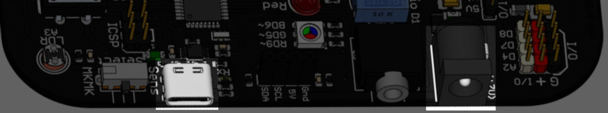
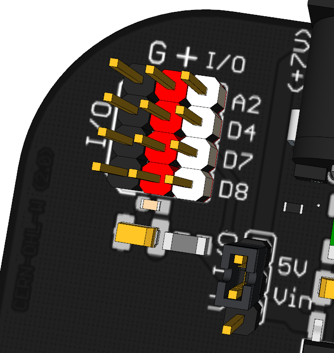
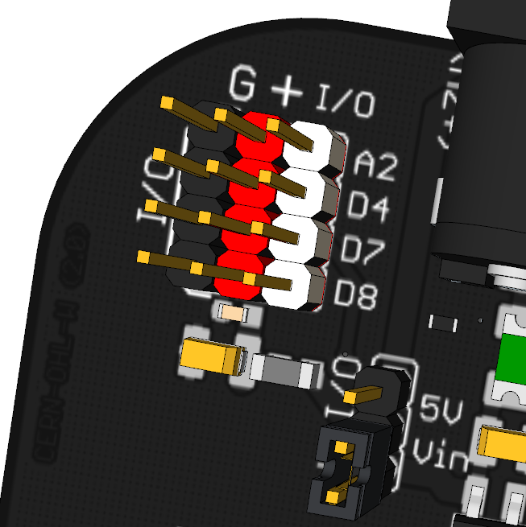

La EchidnaBlack2 se puede alimentar de dos formas: por el **conector USB-C** o por el **jack de alimentación**, con una fuente externa de 7 a 12 V.

## Por USB-C

Es la forma **más recomendable** para la mayoría de los usos, y la más sencilla y común: un cable USB-C conectado al ordenador. Toda la placa recibe una tensión regulada de **5 V**, con energía suficiente para las funciones básicas.

El puerto USB del ordenador suele limitar la corriente a **500 mA**. La placa cuenta con un **fusible rearmable** de protección.

## Por el jack

Se usa para conectar elementos con **mucha potencia**, como varios servomotores, o para **proyectos autónomos**, sin ordenador. La placa regula internamente la tensión de la fuente externa a **5 V**, con un máximo de **1 A**, y también cuenta con un **fusible rearmable** (no hay que superar 1 A de corriente constante).

Con el jack, las entradas y salidas pueden tomar la energía directamente de la fuente externa: se elige con el [selector de alimentación](#alimentación-de-las-entradas-y-salidas).

**Atención**: para usar la placa con [EchidnaML](/ecosistema/echidnaml/) hay que conectar también el cable USB-C, porque es por donde se comunican el microcontrolador y el ordenador.

## Alimentación de las entradas y salidas

La placa tiene tres pines digitales de entrada y salida (**D4, D7 y D8**) y uno analógico (**A2**) para conectar componentes externos: servomotores, sensores de distancia por infrarrojos, sensores de humedad del suelo… Cada uno tiene una conexión a 0 V (**G**), otra a 5 V (**+**) y el pin de señal (**I/O**).

Junto a ellos hay un **selector**: según dónde se coloque el *jumper*, la conexión **+** de las entradas y salidas toma la energía de un sitio o de otro.

### Posición 5V

La energía viene del **regulador de tensión** interno de la placa o del puerto USB. Es la opción ideal para **sensores y componentes de bajo consumo**, y para los sensores externos que necesitan una tensión estabilizada.

**Atención**: el consumo total de los componentes conectados a la línea de 5 V tiene un límite absoluto de **500 mA**, y se recomienda **no superar los 300 mA**. Si se excede, la placa puede apagarse por protección o se puede sobrecargar el regulador interno. Por eso no hay que usar esta posición con servomotores que consuman más de 300 mA.

### Posición Vin

La energía se toma directamente de la **fuente externa** conectada al jack. Es la opción recomendable para **actuadores de mayor consumo**, como servomotores o motores de corriente continua, para no saturar la línea de 5 V de la placa.

Esta alimentación cuenta con un **filtro L-C**, que evita que las interferencias de los motores lleguen al microcontrolador.

El consumo de la placa está en sus [características técnicas](/ecosistema/echidnablack2/caracteristicas-tecnicas/).
