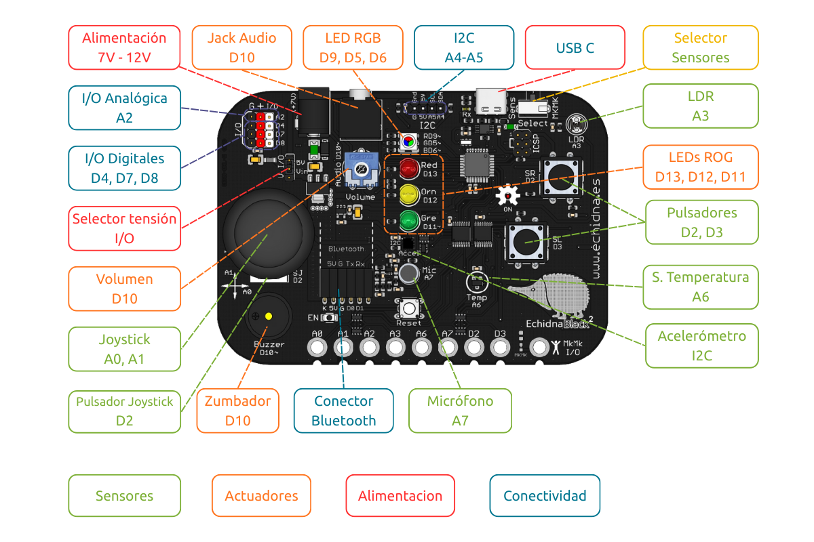
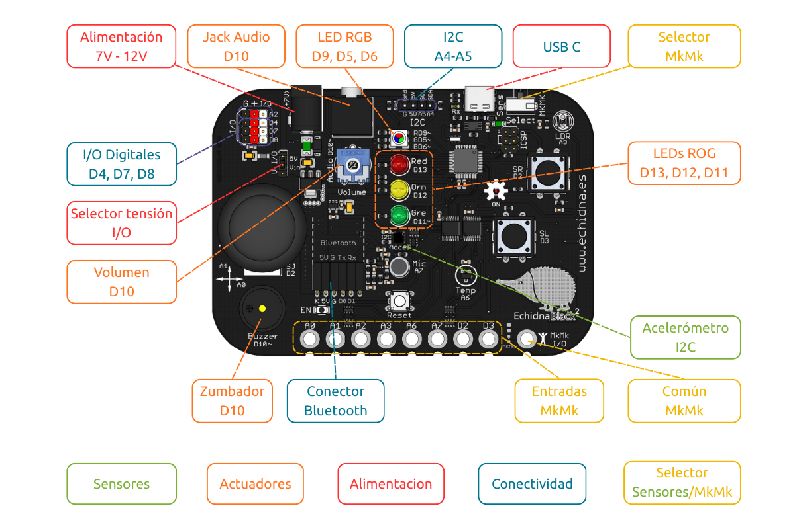

La EchidnaBlack2 tiene dos modos de funcionamiento: el **modo sensores** y el **modo MkMk**. Algunos pines de la placa se comparten entre los sensores integrados y las [entradas MkMk](/ecosistema/echidnablack2/conexiones-mkmk/), y el modo decide cuáles de ellos funcionan.

## El conmutador

El modo se elige con un **conmutador**, rotulado *Select*, en la parte superior derecha de la placa:

- hacia la izquierda (*Sens*), **modo sensores**;
- hacia la derecha (*MkMk*), **modo MkMk**.

**Atención**: cuando el modo MkMk está activo, se enciende un **LED rojo** de aviso en la parte inferior de la placa.

## Modo sensores

Lee todos los **sensores integrados**: los pulsadores SR y SL, el joystick con su pulsador, el sensor de luz, el sensor de temperatura, el micrófono y el acelerómetro. También funcionan todas las conexiones de entrada y salida, incluidas las I2C.

Las entradas MkMk no funcionan en este modo.

## Modo MkMk

Da acceso a las **8 entradas conductivas** tipo Makey Makey (MkMk) y a las entradas que no se usan en este modo: el acelerómetro, el conector I2C y las entradas y salidas digitales D4, D7 y D8.

Los sensores que comparten pin con las entradas MkMk dejan de funcionar.

## Qué cambia en cada modo

| Pin | Modo sensores | Modo MkMk |
|---|---|---|
| A0 | Joystick, eje X | MkMk0 |
| A1 | Joystick, eje Y | MkMk1 |
| A2 | Entrada y salida analógica A2 | MkMk2 |
| A3 | Sensor de luz (LDR) | MkMk3 |
| A6 | Sensor de temperatura | MkMk4 |
| A7 | Micrófono | MkMk5 |
| D2 | Pulsador SR y pulsador del joystick | MkMk6 |
| D3 | Pulsador SL | MkMk7 |

En los dos modos funcionan igual:

- todos los **actuadores**: los [LEDs](/ecosistema/echidnablack2/leds/), el [LED RGB](/ecosistema/echidnablack2/led-rgb/) y el [audio](/ecosistema/echidnablack2/audio/);
- el [acelerómetro](/ecosistema/echidnablack2/acelerometro/) y el conector **I2C** (A4 y A5);
- las entradas y salidas digitales **D4, D7 y D8**;
- el conector **Bluetooth**.
