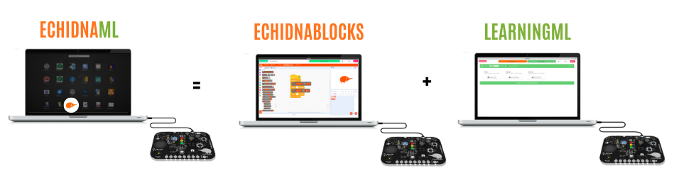

**EchidnaML** es el programa oficial para las placas Echidna. Es una aplicación de escritorio que reúne en una sola interfaz la programación por bloques, la robótica y la inteligencia artificial.

Integra dos herramientas que trabajan juntas:

- **EchidnaBlocks**: una versión de [Scratch](https://scratch.mit.edu/) con bloques propios para controlar los sensores y actuadores de la placa y usar modelos de inteligencia artificial.
- **LearningML**: un módulo de aprendizaje automático (*machine learning*) para crear y entrenar modelos de inteligencia artificial sin salir de la aplicación.

## Ventajas

- **Conectar y listo**: reconoce la placa y se puede empezar a trabajar con ella directamente.
- **Todo en uno**: no hace falta cambiar de programa para pasar de la robótica a crear modelos de inteligencia artificial.
- **Continuidad**: los modelos creados en LearningML se usan directamente en los proyectos de EchidnaBlocks.
- **Seguridad**: al ser una aplicación de escritorio, funciona sin conexión y ofrece un entorno controlado para el aula.

## Créditos

EchidnaML lo ha desarrollado [Juan David Rodríguez](https://web.juandarodriguez.es/), del equipo de Echidna. Su código es libre: las licencias de cada parte están en [Licencias](/quienes-somos/licencias/#software).
