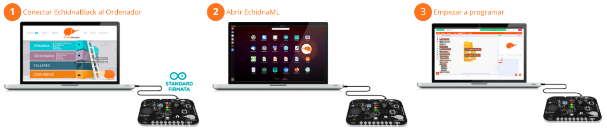
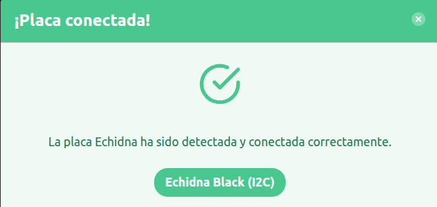
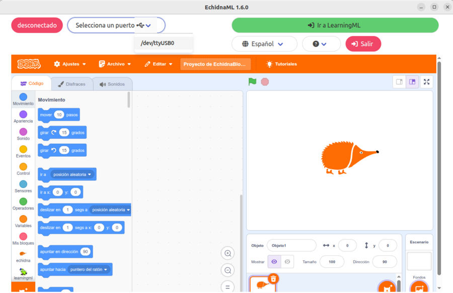

Una vez [descargado e instalado EchidnaML](/ecosistema/echidnaml/descarga/), ya puedes empezar a programar la placa. Es muy sencillo: la placa lleva los sensores y actuadores integrados y el programa la detecta automáticamente.

## Puesta en marcha

### 1. Conecta la placa al ordenador

Conecta la placa al ordenador con el cable USB-C **antes de abrir EchidnaML**.

Las placas Echidna traen cargado de fábrica el programa StandardFirmata, que permite que el ordenador se comunique con ellas por el USB. Si alguna vez hay que volver a cargarlo, se explica en [Instalar StandardFirmata](/ecosistema/echidnaml/instalar-standardfirmata/).

### 2. Abre EchidnaML

Haz clic en el icono de EchidnaML. Al abrirse, el programa detecta la placa y su modelo (EchidnaBlack o EchidnaBlack2) y muestra este aviso:

Si no la detecta: en Windows, comprueba que has instalado el [controlador CH341](/ecosistema/echidnaml/descarga/#controlador-de-la-placa); si sigue sin detectarla, vuelve a cargar StandardFirmata en la placa.

### 3. ¡Empieza a programar!

En la lista de categorías de bloques aparece una nueva, **echidna**. Al hacer clic en ella verás los bloques para usar los sensores y actuadores de la placa, que puedes combinar con los bloques de Scratch que ya conoces para crear todo tipo de proyectos que conectan el mundo físico con el virtual. Para dar los primeros pasos, sigue con [Empezar con EchidnaBlocks](/ecosistema/echidnaml/empezar-echidnablocks/).

## Trabajar sin la placa

EchidnaML también funciona sin la placa conectada. Así puedes:

- crear modelos de inteligencia artificial con LearningML;
- usar EchidnaBlocks como Scratch;
- preparar un programa de robótica y guardarlo para cuando conectes la placa.

## Reconectar la placa

Si abriste el programa sin la placa, puedes conectarla después: conéctala al USB y pulsa el icono del USB, junto a «Selecciona un puerto», para que EchidnaML la detecte.

**Atención**: al reconectar la placa con EchidnaML abierto se pierde el trabajo que no esté guardado. Guárdalo antes para poder recuperarlo.
