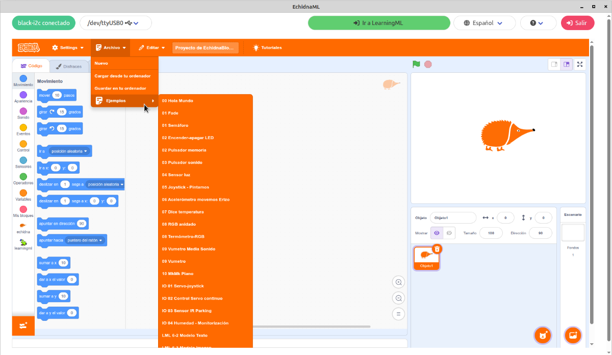
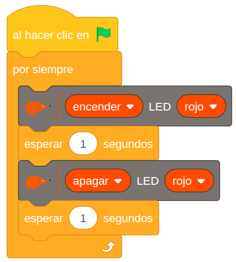

**EchidnaBlocks** es una versión de [Scratch](https://scratch.mit.edu/) con bloques propios para controlar la placa EchidnaBlack y para usar modelos de inteligencia artificial creados con LearningML. Si aún no has conectado la placa, empieza por [Conectar EchidnaML y EchidnaBlack](/ecosistema/echidnaml/conectar-placa/).

## El entorno de programación

## Comunicación entre la placa y el programa

EchidnaBlocks se comunica con el microcontrolador de la placa por el puerto serie, a través del cable USB. La placa envía el estado de sus sensores; el programa que haces en EchidnaBlocks lo procesa y le devuelve las órdenes para sus actuadores.

En la placa funciona para ello el programa StandardFirmata, que viene cargado de fábrica (si hay que volver a cargarlo, se explica en [Instalar StandardFirmata](/ecosistema/echidnaml/instalar-standardfirmata/)).

## Menú Archivo y ejemplos

En el menú **Archivo** encontrarás:

- **Nuevo**: para empezar un proyecto.
- **Guardar en tu ordenador**: como EchidnaBlocks es un programa de escritorio, los proyectos se guardan en una carpeta de tu ordenador.
- **Cargar desde tu ordenador**: para abrir un proyecto guardado.
- **Ejemplos**: programas listos para probar, estudiar y modificar.

Los proyectos se guardan en formato **.sb3**, el mismo de Scratch. Por eso puedes abrir en EchidnaBlocks cualquier proyecto hecho en Scratch y darle interactividad con los sensores de la placa.

En Echidna creemos que una de las mejores formas de aprender es a partir de ejemplos. Por eso te los damos para que los pruebes, los estudies y los modifiques, que es una de las esencias del software libre. Los encontrarás explicados en el [manual](https://echidnaeducacion.github.io/manual/04-componentes-bloques/componentes-placa/).

## Tu primer programa: «Hola, mundo»

El «Hola, mundo» de la robótica es un LED que parpadea:

El programa empieza con el bloque **al hacer clic en** (la bandera verde): todo lo que va debajo se ejecuta al pulsar la bandera verde. El bloque **por siempre** repite sin parar, de arriba abajo, estos pasos:

1. **encender LED rojo**: enciende el LED.
2. **esperar 1 segundos**: lo mantiene encendido un segundo.
3. **apagar LED rojo**: lo apaga.
4. **esperar 1 segundos**: lo mantiene apagado un segundo antes de volver al paso 1.

## Sigue aprendiendo

Cuando domines el «Hola, mundo», continúa con los proyectos de inicio:
