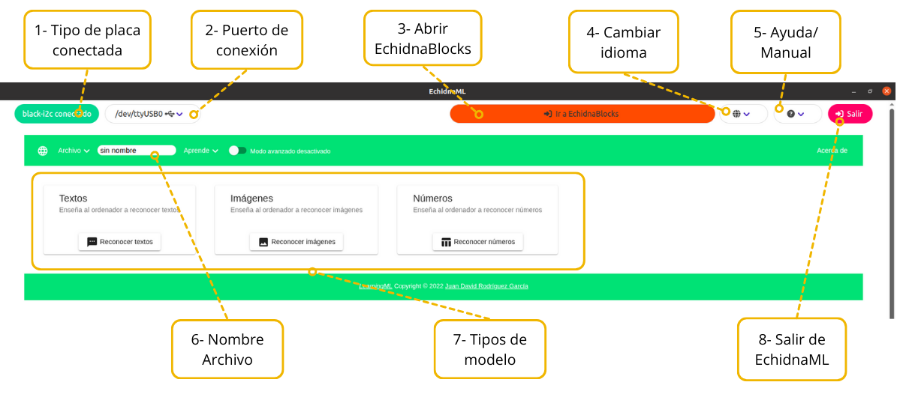
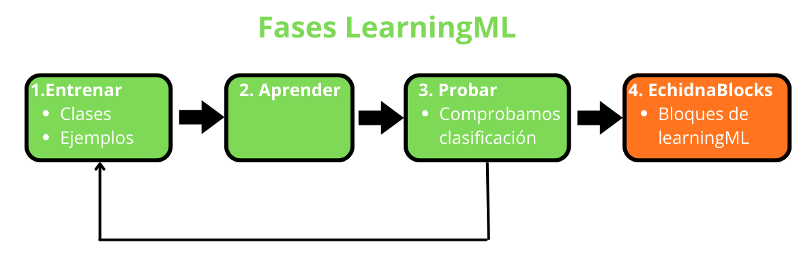
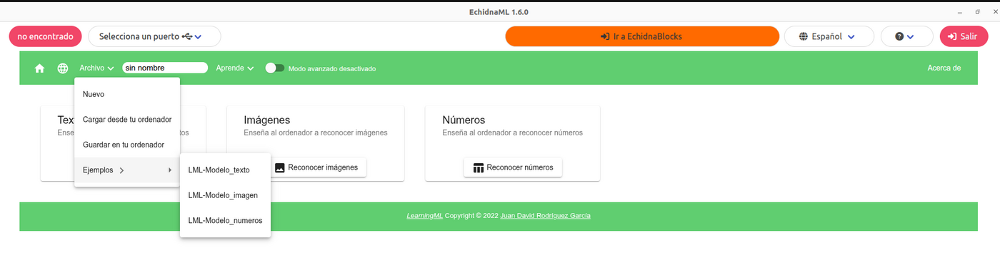

**LearningML** es una herramienta educativa para aprender los conceptos básicos del aprendizaje automático (*machine learning*) de forma sencilla, visual y manipulativa. Con ella, el alumnado crea modelos que clasifican **textos**, **imágenes** o **números** y después los usa en proyectos con bloques de Scratch.

Su objetivo es que el alumnado comprenda cómo se **entrenan** los modelos, qué **datos** necesitan, cómo influyen los **sesgos** y cómo se usan después para tomar **decisiones**. Todo ello sin programación compleja, favoreciendo el pensamiento computacional y el análisis crítico de la inteligencia artificial.

EchidnaML incluye LearningML, que se puede usar por sí solo o junto con los bloques de robótica de [EchidnaBlocks](/ecosistema/echidnaml/empezar-echidnablocks/).

## Abrir LearningML

Desde EchidnaBlocks, pulsa el botón **Ir a LearningML**, en la parte superior de la pantalla.

## El entorno de LearningML

En la pantalla de LearningML puedes:

1. Ver si la placa está conectada y qué modelo es.
2. Ver el puerto de conexión y reconectar la placa si hace falta.
3. Abrir EchidnaBlocks.
4. Cambiar el idioma.
5. Acceder a la ayuda y al manual.
6. Poner nombre al archivo.
7. Elegir el tipo de modelo que vas a crear: textos, imágenes o números.
8. Salir del programa.

## Fases para crear un modelo

Para crear un modelo de aprendizaje automático hay que seguir estas fases:

1. **Entrenar**: elige el tipo de modelo, crea las clases y añade ejemplos de cada una para que el ordenador aprenda a reconocerlas.
2. **Aprender**: el ordenador construye el modelo a partir de esos ejemplos.
3. **Probar**: comprueba que el modelo clasifica bien. Si no lo hace como quieres, vuelve a la fase de entrenar y revisa o añade ejemplos.
4. **Usarlo en EchidnaBlocks**: cuando las pruebas salgan bien, abre EchidnaBlocks y usa los bloques de LearningML con el modelo que acabas de crear. Si EchidnaBlocks ya estaba abierto, no hace falta volver a abrirlo: el modelo está disponible en cuanto se genera.

## Menú Archivo

En el menú **Archivo** de LearningML encontrarás:

- **Nuevo**: para empezar un modelo.
- **Guardar en tu ordenador**: guarda los datos de entrenamiento del modelo en una carpeta de tu ordenador.
- **Cargar desde tu ordenador**: recupera unos datos de entrenamiento guardados.
- **Ejemplos**: modelos de ejemplo para probar, estudiar y modificar.

Los datos de entrenamiento se guardan en formato **.json**, compatible con LearningML de escritorio y en línea. Después de cargar un archivo hay que pulsar **Aprender** para poder usar el modelo.

Para saber más sobre LearningML, consulta la [web del proyecto](https://web.learningml.org/).

## Sigue aprendiendo

Cuando sepas crear un modelo, continúa con los proyectos de inicio con inteligencia artificial:
