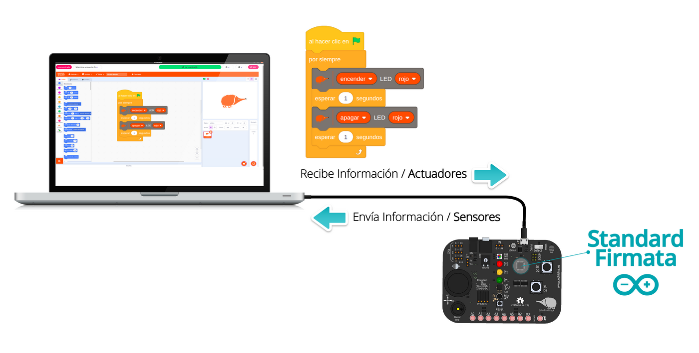
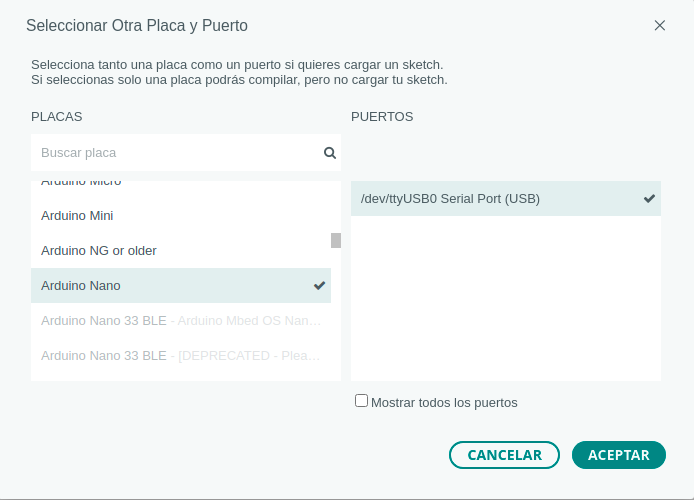

Para trabajar con EchidnaML, la placa necesita tener instalado un programa llamado **Firmata**, que permite que se comunique con el ordenador. Las placas Echidna lo traen **instalado de fábrica**, así que lo normal es que no tengas que hacer nada. Si se ha borrado, por ejemplo porque has cargado otro programa en la placa, aquí te explicamos cómo volver a instalarlo.

## ¿Qué es Firmata?

**Firmata** es un protocolo que facilita la comunicación entre microcontroladores y ordenadores. Permite que el programa que se ejecuta en EchidnaML interactúe con la placa en tiempo real a través del puerto serie: la placa envía constantemente las lecturas de sus sensores y el programa, tras procesarlas, le devuelve las órdenes para controlar los actuadores.

En la EchidnaBlack se usa **StandardFirmata**, la versión de Firmata que incluye el IDE de Arduino.

## Cómo instalar StandardFirmata

Se instala con el **IDE de Arduino**, siguiendo estos pasos:

1. **Instala el IDE de Arduino.** Está disponible para GNU/Linux, macOS y Windows, y se descarga desde la [web de Arduino](https://www.arduino.cc/en/software/), donde también hay una guía para instalarlo.
2. **Conecta la placa** al ordenador con el cable USB.
3. **Abre el IDE de Arduino.**
4. **Elige la placa y el puerto.**
   - **Placa**: para la EchidnaBlack y la EchidnaBlack2, elige **Arduino Nano**, en Herramientas › Placa › Arduino Nano. Si usas una EchidnaShield, elige **Arduino UNO**.
   - **Puerto**: elige el puerto USB al que está conectada la placa. Su nombre depende del sistema operativo, por ejemplo `/dev/ttyUSB0` en GNU/Linux, `COM21` en Windows o `/dev/cu.usbserial-1410` en macOS. El número puede cambiar según los dispositivos que tengas conectados.
5. **Abre StandardFirmata**, en Archivo › Ejemplos › Firmata › StandardFirmata. Si no has elegido la placa en el paso anterior, no aparecen los ejemplos de Firmata.
6. **Carga el programa en la placa** con el botón **Subir**.

Ya está: la placa está lista para programarla con EchidnaML. StandardFirmata se queda instalado aunque desconectes la placa, y se pone en marcha cada vez que la vuelves a conectar, así que **solo tienes que cargarlo una vez**.

## Otros programas

Aquí hemos usado el IDE de Arduino, pero StandardFirmata también se puede cargar con otros programas, como:

- [PlatformIO](https://platformio.org/install)
- [Eclipse Arduino IDE](https://www.eclipse.org/community/eclipse_newsletter/2017/april/article4.php)
- [Codebender](https://codebender.cc/)
- [ArduinoDroid](https://play.google.com/store/apps/details?id=name.antonsmirnov.android.arduinodroid2), para Android
- [Programino](https://programino.com/download-programino-ide-for-arduino.html)
