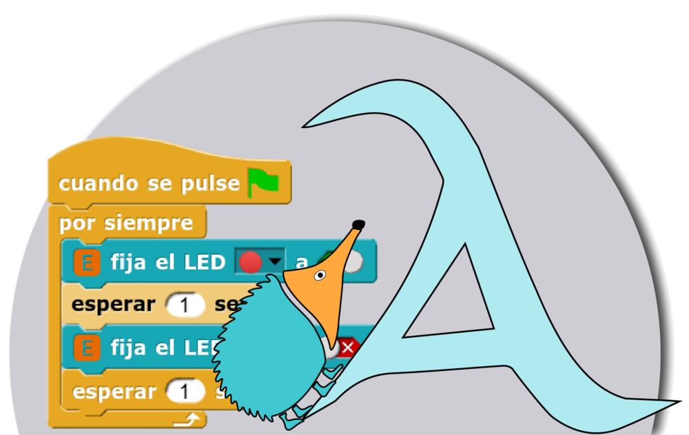

**Snap!** es un entorno de programación visual por bloques, potente y versátil, desarrollado por la Universidad de Berkeley (California). Aunque se parece a Scratch, está pensado para explorar conceptos avanzados de informática de una forma más profunda y rigurosa.

En el ecosistema Echidna, Snap! es la herramienta ideal para el alumnado de **Secundaria y Bachillerato** que ha superado las limitaciones de Scratch y busca más control sobre la placa y los datos.

## Características

- **Libre y en línea**: es software libre y gratuito, y se usa directamente desde el navegador, en [snap.berkeley.edu](https://snap.berkeley.edu/), sin instalar nada.
- **Un lenguaje completo**: permite crear bloques propios, usar recursividad y trabajar con estructuras de datos complejas.
- **Un entorno sobrio**: su interfaz es menos colorida que la de Scratch y deja un espacio de trabajo despejado para proyectos complejos.
- **Para profundizar**: está orientado a quienes quieren avanzar en la lógica de programación y en la ciencia de la computación.
- **Librerías para Echidna**: Snap! permite añadir librerías con bloques para trabajar con la placa.

## Materiales en preparación

Estamos preparando la librería de bloques para la **EchidnaBlack2** y una guía para empezar a usarla en el aula. Mientras tanto, puedes seguir el desarrollo de la librería en su [repositorio de GitHub](https://github.com/EchidnaEducacion/S4A-EchidnaBlack2C).
