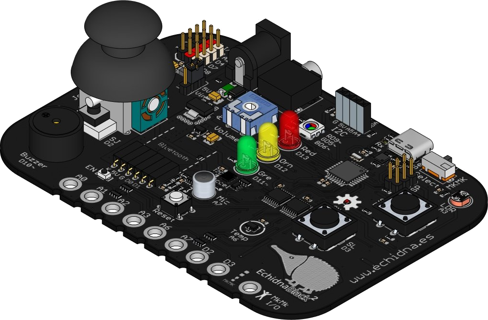

La **EchidnaBlack2** está a la venta en [Leal Educa](https://lealeduca.com/producto/echidna-black-placa-autonoma/), que la distribuye.

## La EchidnaBlack2

- Placa autónoma compatible con Arduino Nano y Arduino UNO.
- Sensores integrados: pulsadores, joystick, acelerómetro, luz, temperatura y micrófono.
- Actuadores integrados: LED, LED RGB y audio.
- 8 entradas conductivas tipo Makey Makey (MkMk).
- Entradas y salidas para conectar complementos, y conector para un módulo Bluetooth.

Todo sobre la placa está en su [ficha](/ecosistema/echidnablack2/) y en sus [características técnicas](/ecosistema/echidnablack2/caracteristicas-tecnicas/).

## Qué incluye

- Placa EchidnaBlack2 programada con el firmware **StandardFirmata**, lista para usar con EchidnaML.
- Cable USB tipo A a C, de 1 metro de longitud.
- Caja de cartón de 1,4 mm de grosor, de 130 × 94 × 45 mm, color cartón natural, con impresión en tinta blanca.
- Hoja de instrucciones dentro de la caja: formato A4 plegado a A7, impresa a color por ambas caras.

## Qué necesitas para empezar

- Un ordenador con [EchidnaML](/ecosistema/echidnaml/descarga/), el programa para programarla, que es gratuito.
- Los [materiales del alumnado](/alumnado/) y los [recursos docentes](/docentes/), todos libres.
